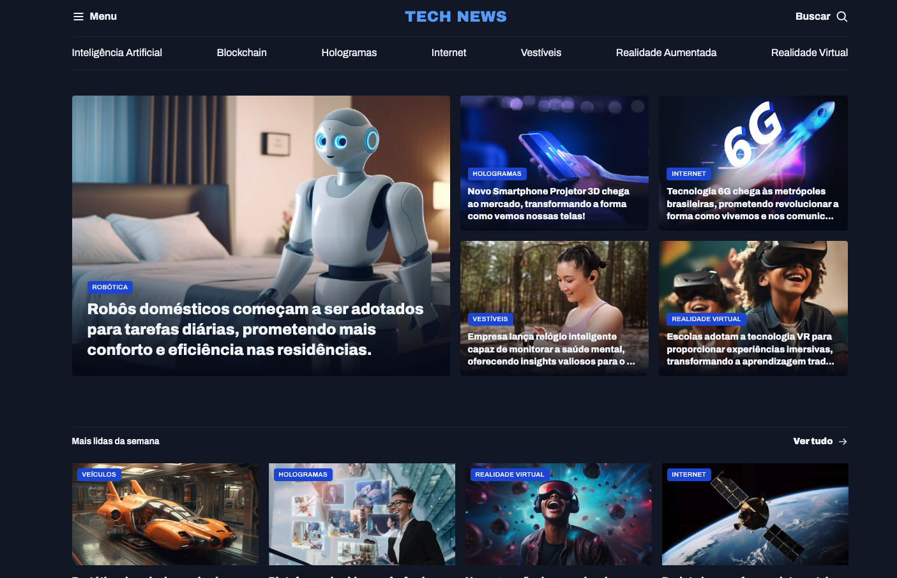

# 🚀 Portal de Notícias - Tech News



## 📋 Descrição

Portal de Notícias desenvolvido durante o curso Full Stack da Rocketseat. Este projeto apresenta um site moderno e responsivo focado em notícias de tecnologia, com design dark theme e interface intuitiva.

## ✨ Funcionalidades

- **Design Moderno**: Interface dark theme com cores azuis e brancas
- **Layout Responsivo**: Adaptável para diferentes tamanhos de tela
- **Seções Organizadas**:
  - Destaques em destaque
  - Mais lidas da semana
  - Seção especial de Inteligência Artificial
- **Navegação Intuitiva**: Menu de categorias tecnológicas
- **Categorias Tecnológicas**:
  - Inteligência Artificial
  - Blockchain
  - Hologramas
  - Internet
  - Vestíveis
  - Realidade Aumentada
  - Realidade Virtual

## 🛠️ Tecnologias Utilizadas

- **HTML5**: Estrutura semântica e acessível
- **CSS3**:
  - CSS Grid para layout responsivo
  - CSS Custom Properties (variáveis CSS)
  - Flexbox para alinhamentos
- **Google Fonts**: Fonte Archivo para tipografia moderna
- **Design System**: Sistema de cores e tipografia consistente

## 🎨 Design System

### Cores

- **Background**: `#0f172a` (Dark Blue)
- **Brand Light**: `#60a5fa` (Light Blue)
- **Brand Dark**: `#1d4ed8` (Dark Blue)
- **Text Primary**: `#f1f5f9` (Light Gray)
- **Text Secondary**: `#cbd5e1` (Medium Gray)

### Tipografia

- **Família**: Archivo (Google Fonts)
- **Hierarquia**: H1, H2, H3 com pesos variados
- **Responsividade**: Tamanhos adaptáveis

## 📁 Estrutura do Projeto

```
Portal-de-noticias/
├── assets/
│   ├── icons/          # Ícones SVG
│   ├── images/         # Imagens dos artigos
│   ├── logo.svg        # Logo do site
│   └── readme.png      # Screenshot do projeto
├── styles/
│   ├── global.css      # Estilos globais e variáveis
│   ├── header.css      # Estilos do cabeçalho
│   ├── sections.css    # Estilos das seções
│   ├── utility.css     # Classes utilitárias
│   └── index.css       # Arquivo principal de estilos
└── index.html          # Página principal
```

## 🚀 Como Executar

1. **Clone o repositório**:

   ```bash
   git clone https://github.com/rafaelrhp/Portal-de-noticias.git
   ```

2. **Navegue até a pasta**:

   ```bash
   cd Portal-de-noticias
   ```

3. **Abra o arquivo index.html**:

   - Duplo clique no arquivo `index.html`
   - Ou use um servidor local:

     ```bash
     # Com Python
     python -m http.server 8000

     # Com Node.js (se tiver live-server instalado)
     npx live-server
     ```

4. **Acesse no navegador**:
   - Se usando servidor local: `http://localhost:8000`
   - Se abrindo diretamente: arquivo será aberto no navegador padrão

## 🌐 Demo Online

**Acesse o projeto online**: [https://rafaelrhp.github.io/Portal-de-noticias/](https://rafaelrhp.github.io/Portal-de-noticias/)

## 📱 Responsividade

O projeto foi desenvolvido com foco em responsividade, utilizando:

- CSS Grid para layouts complexos
- Flexbox para alinhamentos
- Unidades relativas (rem, em, %)
- Media queries para adaptação mobile

## 🎯 Objetivos do Projeto

- Aplicar conceitos de CSS Grid e Flexbox
- Desenvolver interface moderna com dark theme
- Criar layout responsivo e acessível
- Implementar design system consistente
- Praticar HTML semântico

## 📚 Aprendizados

Durante o desenvolvimento deste projeto, foram aplicados:

- **CSS Grid**: Layout complexo com grid-template-areas
- **CSS Custom Properties**: Sistema de variáveis para cores e tipografia
- **Responsividade**: Design adaptável para diferentes dispositivos
- **Semântica HTML**: Estrutura acessível e bem organizada
- **Design System**: Padrões consistentes de design

## 🤝 Contribuição

Este projeto foi desenvolvido como parte do curso Full Stack da Rocketseat. Contribuições são bem-vindas!

## 📄 Licença

Este projeto está sob a licença MIT. Veja o arquivo [LICENSE](LICENSE) para mais detalhes.

---

**Desenvolvido com ❤️ por Rafael Pedrini**
